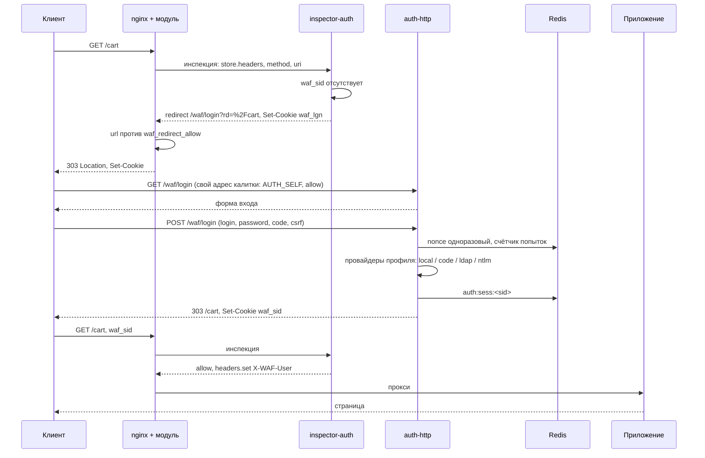

# Второй фактор (auth)

> **Статус.** Спецификация и референсная реализация. Код —
> [`inspectors/auth`](../README.md). Контракт модуля, на
> который опираемся, зафиксирован:
> `docs/inspectors.md`,
> `docs/verdict-protocol.md`,
> `docs/deny-pages.md`.
>
> Челлендж и капча — **другие** модули:
> `docs/inspectors/challenge/README.md`,
> `docs/inspectors/captcha/README.md`. Общего ключа, образа и subject
> у них с этим нет.

Инспектор, который ставит перед приложением калитку входа. Приложение
продолжает проверять своих пользователей само; контур добавляет ещё одну
проверку — ту, которую администратор задал в профиле: одноразовый код, список
логинов и паролей, LDAP или NTLM. Для пользователя это второй фактор, для
приложения — прозрачный заголовок с именем вошедшего.

Модуль nginx о втором факторе не знает ничего: для него это обычный
`waf_inspector auth`, который отвечает `allow`, `redirect` или
`deny`.

## Что решает этот модуль

Отсекает клиента без действующей сессии контура. Что считать доказательством
входа — вопрос профиля; кто именно вошёл — вопрос провайдера.

```
подпись waf_sid сошлась, срок не вышел, привязка совпала, sid не отозван
                                        → allow + заголовки приложению
токена нет или он не принят,
    метод в redirect_methods и это навигация → redirect 303 на login.uri
    иначе                                    → deny  response=auth_required (401)
```

Асимметрия GET и всего остального — не украшение. Редирект на страницу входа
осмыслен только там, где ответ увидит человек в браузере. `POST`, `PATCH`,
`DELETE` и любой `fetch` при 303 теряют тело
(`docs/verdict-protocol.md`), и вместо
формы входа фронтенд получает невнятную ошибку. Поэтому им — 401 с
машиночитаемым телом, по которому клиент сам решает, показывать ли форму.

## Зачем два контейнера, а не один

Две разные нагрузки и два разных SLO — ровно как у
челленджа (`docs/inspectors/challenge/README.md`).

| | Инспектор | HTTP |
| --- | --- | --- |
| Где живёт | шина, `waf.req.auth`, queue group | `location` формы с `proxy_pass`; калитка на нём стоять может -- свой адрес она пропускает |
| Когда зовут | каждый запрос маршрута | только вход, выход и продление |
| Бюджет | `timeout=20ms` | сотни миллисекунд: bcrypt, LDAP, контроллер домена |
| Ответ | вердикт: `allow` / `redirect` / `deny` | HTML формы, `Set-Cookie`, 303 назад |
| Состояние | подпись токена, отзыв из памяти | Redis: nonce, попытки, отзыв |
| Падение | политика `waf_deadline` маршрута | новые сессии не выдаются, действующие живут |

Проверка пароля — это ровно то, что обязано быть медленным: bcrypt считается
десятки миллисекунд по построению, bind к контроллеру домена уходит в сеть.
Держать это в процессе, у которого бюджет 20 мс на весь трафик маршрута,
нельзя. Отсюда **два контейнера, один образ, один каталог**.

Ключ HMAC общий только у `inspector-auth` и `auth-http`. С челленджем и капчей
они не делятся: чужой ключ, чужой тег, чужой subject.

## Что уже решено модулем — не трогаем

Границы, которые реализация обязана уважать. Три из них меняют устройство
сервиса, а не только его код.

**Cookie ставится только вместе с `deny` и `redirect`.** На `allow` модуль
секцию `cookies` ответа не применяет
(`nginx/module/src/runtime/ngx_http_waf_apply.c`):
`ngx_http_waf_cookies()` вызывается из ветки отказа и из ветки редиректа, и
больше ниоткуда. Значит скользящей сессии «продлеваем на каждом запросе» не
существует: продление — это отдельный редирект на `<login>/renew`, см.
[«Продление»](#продление).

**Снятие заголовка запроса не поддерживается.** `headers.unset` на фазе запроса
модуль только логирует. Поэтому подделанный клиентом `X-WAF-User` нельзя
удалить — его можно только перезаписать, и инспектор обязан выставлять **весь**
набор заголовков личности на каждом `allow`, включая пустые значения. См.
[«Заголовки приложению»](#заголовки-приложению).

**Cookie приезжает инспектору из обменника, а не инлайном.** Заголовков в
сообщении нет: они едут локатором `store.headers`
(`docs/verdict-protocol.md`).
Маршрут обязан снимать заголовки и **не** маскировать `cookie`:

```nginx
waf_capture request headers args;     # headers обязательны, args -- ради возврата
# waf_capture headers mask=cookie;    # так инспектор увидит sha256 вместо токена
```

`args` в снимке не обязательны, но без них теряется строка запроса адреса
возврата: инлайном в сообщении едет только путь, а query лежит отдельным
объектом обменника. Клиент, которого увели с `/cart?page=2`, вернётся на `/cart`.
Оба объекта инспектор забирает одним `MGET`, так что второй round-trip это не
добавляет.

Инлайн-драйвер здесь не спасает: горячий путь его не вызывает
(`docs/body-storage.md`), объект всё равно уходит во
внешний обменник. Один `GET` в Redis на запрос маршрута — цена этого инспектора,
и она заложена в `timeout=20ms`, а не в `10ms`.

Остальное — общие границы контракта: код отказа приходит из каталога
`waf_deny_response`, а не с провода; HTML с шины не принимается; адрес
редиректа сверяется с `waf_redirect_allow`; `redirect` запрещён в фазе ответа;
атрибуты `secure` / `http_only` / `same_site` форсирует `waf_cookie_defaults`.

## Поток



Второй запрос без сессии, но не навигационный, идёт другой веткой:

```
POST /api/orders без waf_sid → deny response=auth_required → 401 + тело каталога
```

## Конфигурация nginx

```nginx
waf_inspector auth        subject=waf.req.auth;
waf_inspector auth-admin  subject=waf.req.auth profile=admin;

waf_deny_response auth_required status=401;
waf_redirect_allow /waf/login;

server {
    location / {
        waf_capture  request headers;
        waf_inspect  request auth wave=2 timeout=20ms;
        proxy_pass http://app;
    }

    # Цель редиректа и адрес формы. Рекурсии («вход требует входа») нет при
    # любом наборе инспекторов: калитка узнаёт свой login.uri сама и отвечает
    # на нём allow (AUTH_SELF), так что локейшен может наследовать набор
    # сервера целиком -- списки, лимиты и modsec на форме только к месту.
    location /waf/login {
        waf_local_rate $binary_remote_addr rate=10r/s burst=10 response=too_many;

        proxy_pass http://auth_http;
    }
}
```

Очков он не даёт: инспектор не оценивает, а решает. Поздняя волна — чтобы к его
вопросу счёт уже был накоплен: сам он счёт не читает, но и держать дорогой
`GET` в Redis перед дешёвой проверкой адреса незачем. Ставить `auth` в одну
волну с челленджем нельзя: два `redirect` в одной волне при `waf_deny_mode
fast` — гонка, побеждает ответивший первым.

Порядок ступеней, если на маршруте несколько калиток: `challenge` (умеет ли
клиент JS) → `captcha` (человек ли он) → `auth` (кто он). Каждая на своей
волне.

## Отдельный конфиг: источники и профили

Конфигурация калитки — две сущности, и объявляются они в этом порядке, как
корзины и профили у счётчика (`docs/inspectors/counter/README.md`):

- **источник входа** (`sources/<имя>/source.yaml`) — всё про сам вход:
  провайдер, форма, сессии, активный список, то, что калитка рассказывает
  приложению. Источник и есть пространство сессий: у него ровно одна форма и
  ровно одна кука, и сессия несёт его имя в `iss`;
- **профиль** (`profiles/<имя>/profile.yaml`) — политика одного маршрута:
  режим, условия допуска, правила приёма чужих просьб и ссылка `source:`.

Профиль выбирается тегом `profile=` записи реестра и приезжает инспектору в
`route.profile` — тем же механизмом, что у
`ip` (`docs/inspectors/ip/README.md`) и `modsec` (`docs/inspectors/modsec/README.md`). Один процесс
обслуживает сколько угодно источников и профилей: разные маршруты — разные
способы входа. Профили одного источника принимают сессии друг друга; профили
разных источников независимы, что бы ни было написано в их куках.

```yaml
# sources/default/source.yaml
login:
  uri: /waf/login             # тот самый URI, который настраивает оператор
  title: "Требуется вход"
  note: "Доступ к приложению защищён вторым фактором."

session:
  cookie: waf_sid_default     # умолчание -- waf_sid_<имя источника>; кука
  ttl: 8h                     # уникальна на источник, см. «Сессия и токен»
  renew_after: 1h             # 0 — продления нет
  bind: [subnet, ua]
  subnet: { v4: 24, v6: 64 }

ticket:
  ttl: 10m                    # cookie -- waf_lgn_<имя источника>

list:                         # необязательно, см. «Активный список»
  sessions: auth_sessions
  cookie: waf_sess
  ttl: 8h
  origin: auth

upstream:
  user:   X-WAF-User
  groups: X-WAF-Groups
  method: X-WAF-Auth

provider: local               # local | code | ldap | ntlm | jwt | app — ровно один

identity:                     # только для code с kind totp: чья сессия даёт личность
  from: ""                    # имя ДРУГОГО источника этого процесса

providers:
  local:
    users: users.yaml
  code:
    kind: totp                # totp | static
    digits: 6
    period: 30s
    skew: 1
    users: users.yaml         # секреты TOTP по логину (kind: totp)
  ldap:
    url: ldaps://dc1.corp.example.com:636
    bind: upn                 # upn | dn_template | search
    upn_suffix: "@corp.example.com"
    dn_template: "cn=%s,ou=users,dc=corp,dc=example,dc=com"
    timeout: 3s
    groups: ["CN=WAF Users,OU=Groups,DC=corp,DC=example,DC=com"]
    search:
      base: "dc=corp,dc=example,dc=com"
      filter: "(&(objectClass=user)(sAMAccountName=%s))"
      bind_dn: "cn=svc-waf,ou=svc,dc=corp,dc=example,dc=com"
      password_env: WAF_AUTH_LDAP_PASSWORD
  ntlm:
    url: ldap://dc1.corp.example.com:389
    domain: CORP
    timeout: 3s
  jwt:                        # чужой токен, см. «jwt»
    cookie: access_token
    verify: { alg: RS256, key_file: jwt.key }
  app:                        # кука приложения через подглядывание, см. «app»
    cookie: JSESSIONID
    learn:
      login: { uri: /api/login }
      user:  { from: body.form, field: username }

lockout:
  attempts: 5
  window: 10m
  lock: 15m

roster:
  store: redis                # redis | memory
  prefix: "auth:"
  revoke_refresh: 2s
```

```yaml
# profiles/default/profile.yaml
mode: enforce                 # печатает контроллер; режим вызова -- на маршруте (waf_inspect … mode=)

source: default               # чьи сессии принимаем и чья форма обслуживает

gate:
  redirect_methods: [GET, HEAD] # пусто -- 401 всем без сессии, даже на GET
  redirect_status: 303
  deny_response: auth_required
  html_only: true             # GET без text/html в Accept -> 401, а не 303
  # inline: true -- форма телом ответа на том же URI вместо редиректа: инспектор
  # выписывает билет, берёт форму у auth-http (WAF_AUTH_HTTP_URL), кладёт её в
  # обменник и отвечает deny с секцией rewrite; модуль отдаёт объект телом с кодом
  # deny_response. Записи каталога и прокси-локации не нужны; форма не
  # досталась -- редирект, как без inline.
  inline: false

trigger:                      # просьбы соседей, см. ниже
  reauth_after: 5m            # сессия моложе -- reauth не действует; 0 — всегда
  prior:
    - from: "*"               # "*" — любой отправитель
      accept: [reauth]
    - from: edge
      accept: [skip]
      codes: [HEALTHCHECK]    # пусто — любой повод

rules:                        # что калитка говорит сама, см. ниже
  - { on: authenticated, to: captcha, do: skip, code: SIGNED_IN }
  - { on: authenticated, to: vlai, do: off }
  - { on: anonymous, to: counter, do: score, value: 20 }   # очки маршруту
  - { on: forbidden, do: mark, marker: wrong door }
  - { on: anonymous, list: gate_anon, write: addr, ttl: 10m }  # addr | net | net_all | asn
```

Каталог перечитывается по отпечатку — правка не требует ни пересборки, ни
рестарта. Файл паролей `users.yaml` и своя страница `login.html` живут рядом с
`source.yaml` и перечитываются вместе с ним.

Режима у профиля больше нет: включена ли калитка и гейтит ли она, решает
вызов на маршруте — `waf_inspect … mode=active|passive|vote|off`
(`docs/directives/list/inspect.md`). Выкатить калитку на живой
маршрут, не заперев пользователей, — `mode=passive` там; ключ `mode:` в
YAML печатает контроллер (`enforce`, а профилю без источника — `"off"`) ради
загрузчика, у которого он пока обязателен. Файловые профили с `observe` /
`off` загрузчик по-прежнему понимает (общий контракт —
`docs/inspectors.md`), но панель их не
предлагает.

**Источник — единственное, что делает профиль проверкой**: без него профиль
ничего не проверяет (контроллер печатает ему `mode: "off"`), а с ним и
защита, и наблюдение открывают сессии. У
источника обязательны и форма (`login.uri`), и провайдер: источник, который не
способен никого впустить, — не источник.

**Реестр держит межобъектные гарантии.** У формы ровно один хозяин
(`sources A and B share login.uri`), у куки — тоже (`share session cookie`),
ссылка `source:` и `identity.from` обязаны разрешаться. Любое нарушение
отвергает поколение целиком, действующий набор при этом не трогается.

**Секция `roster` — свойство процесса, а не источника.** Множество отзыва
читается одно на всех, и два префикса означали бы два множества у одного
инспектора. Объявляется она в источнике, потому что там её ищут, но расхождение
между источниками отвергает поколение целиком.

### Просьбы соседей: `trigger.prior`

Калитка — слушатель глагола `reauth`
(канал действий (`docs/inspector-actions.md`)): инспектор, которому сессия
показалась перехваченной, просит потребовать вход заново. Просьба — не команда:
она действует только там, где в профиле есть правило `from`/`accept`, без
правила она видна лишь в аудите.

Из словаря канала калитка применяет два глагола, остальные ей не адресованы, и
правило с ними не грузится — как и у капчи, правило, которое не сработает
никогда, считается опечаткой, а не политикой:

| `accept` | Что делает | Ограничение |
| --- | --- | --- |
| `reauth` | целая сессия едет на форму входа, как будто её нет: это вход заново, а не продление `/renew` | можно `from: "*"` — ужесточение |
| `skip` | не проверять этот запрос: клиент проходит без личности, заголовки перезаписываются пустыми | только с именем отправителя — послабление |

Числовые глаголы (`threshold`, `note`) калитка не применяет — ни своего
порога, ни памяти про субъектов у неё нет, и правило с таким глаголом не
грузится.

**`reauth_after` — защита от карусели.** Отправитель шлёт действие на каждом
запросе и не знает, что вход уже случился. Сессия моложе `reauth_after`
считается только что подтверждённой, и просьба на неё не действует; ноль
выключает отсечку. Умолчание — `5m`.

Исход каждой доставленной просьбы — `applied` либо `no_rule` — калитка называет
в своём событии `kind=inspector`, как требует
наблюдаемость канала (`docs/inspector-actions.md`): молчание в
ответ на просьбу и есть тот случай, который потом разбирают.

### Что калитка говорит сама: `rules`

Калитка знает о клиенте то, чего не знает никто другой: вошёл ли он и кто он.
Правила по событиям волны — та же форма «когда → что сделать», что у капчи и
профиля адреса, — отдают это соседям и маршруту. Действие у правила ровно
одно: просьба соседу (`to`/`do`/…, форма канала действий целиком) либо запись
в живой набор (`list` + `write` + `ttl`).

| `on` | Когда | Что доедет |
| --- | --- | --- |
| `authenticated` | сессия цела и допуск есть | любая просьба: `skip` капче, `off` vlai, скидка modsec, `note` счётчику, `mutate` rewrite, глаголы записи, очки |
| `anonymous` | куки нет вовсе | только запись маршрута: `audit`, `archive`, `mark`, `score` — и набор |
| `invalid` | кука была, но не годится: истекла, отозвана, чужая сеть или источник | то же |
| `forbidden` | вошёл, но не в ту дверь: группы допуска нет | то же |

Ограничение трёх последних не стиль, а физика канала: отказ и редирект
обрывают фазу, поздних волн не будет, и просьбе соседу оттуда не уехать.
Глаголы записи исполняет модуль, а отказ для них главный случай. Событие —
про клиента, а не про вердикт: под наблюдением или пассивным вызовом аноним
остаётся анонимом, и его правила срабатывают так же.

Сценарий, ради которого это заведено: «вошедшим капчу не показывать и
классификатор не звать» — прежде он собирался только условием `if` на
маршруте по куке, теперь это две строки профиля. События — состояния, и
запись в набор публикуется на каждом срабатывании: аноним ходит каждым
запросом, и каждый его запрос с такой строкой — это `add` в keeper, который
продлевает срок. Памяти «уже записано» у калитки нет намеренно; если запись
должна прекратить повторы, набор ставят перед калиткой. Повод у просьбы свой
(`code`), у записи без повода — `AUTH_<событие>`.

`write` называет, что уедет, — те же четыре вида, что у всех отправителей
(modsec (`docs/inspectors/modsec/README.md`)):
`addr` — адрес клиента (умолчание), `net` — эффективный анонс, `net_all` — все
анонсы над адресом, включая чужие широкие, `asn` — состав системы целиком. У
просьбы субъекта нет, и строка с `write` и `to` разом не грузится. Анонсы и
состав калитка спрашивает у кодера гео по gRPC (`WAF_AUTH_GEO_ADDR`, у стенда
`geo:50051`) синхронно, в бюджете сообщения, и только для строк
`net`/`net_all`/`asn`; пачка уходит одним кадром keeper. Кодер нужен и молчит —
ответ `error` с `AUTH_GEO_UNAVAILABLE`, исход выбирает `waf_exception` маршрута:
бан, которого не было, не выдаётся за бан.

### Что задаёт оператор, а что вычисляется

| Параметр | Кто задаёт | Почему не по умолчанию |
| --- | --- | --- |
| `login.uri` источника | оператор | Путь обязан совпасть с `location` в nginx и с `waf_redirect_allow`; угадать его нельзя |
| `provider` источника | оператор | Способ входа — это политика, а не свойство сервиса; комбинации — набором инспекторов маршрута |
| `session.ttl` источника | оператор | Компромисс удобства и риска; у админки и витрины он разный |
| `source` профиля | оператор | Чьи сессии принимает маршрут — политика; профили одного источника дружат, разных — независимы |
| `gate.groups` профиля | оператор | Кого пускать в эту зону — политика; пустой список означает «довольно входа» |
| `session.bind` | умолчание | Подсеть и отпечаток UA — цена угона cookie, снимать её осознанно |
| `ticket.*` | умолчание | Внутренняя механика формы, наружу не видна |

### Публичный путь делается маршрутом, а не списком

Списка исключений у калитки нет намеренно. Путь, который должен быть открыт,
открывают тем, что не объявляют на нём инспектор:

```nginx
location = /auth/healthz {          # калитки нет: до шины запрос не доходит
    proxy_pass http://backend/healthz;
}

location /auth/ {
    waf_inspect request auth wave=1 timeout=20ms;
    proxy_pass http://backend/;
}
```

Список путей в профиле стоил бы сообщения на шину и ответа инспектора на каждой
пробе, а вердикт был бы тот же `allow`. И, что хуже, держал бы второе место, где
решают, что публично: `waf_inspect` в локейшене говорит одно, список в профиле —
другое, и расходятся они молча.

Закрытый путь с другой формой отказа — 401 всегда, даже на навигационном GET,
как хочется путям API — делается так же: **отдельным профилем**, как у капчи.
Профиль-спутник называет тот же источник, что главная калитка, и оставляет
`redirect_methods` пустыми:

```yaml
# profiles/shop-api/profile.yaml
mode: enforce
source: shop                  # тот же источник: общее пространство сессий,
gate:                         # вход один на двоих
  redirect_methods: []        # на форму не уводим никого: всем без сессии 401
  deny_response: auth_required
```

Пространство сессий и есть источник: токен несёт в `iss` имя источника, в
`scp` — имя его куки, и профиль принимает токен только своего источника.
Чужая кука отвечает `AUTH_SESSION_SCOPE`, чужой источник при совпавшей куке —
`AUTH_SESSION_SOURCE`; общее пространство — явная ссылка `source:` на один
источник, а не совпадение строк в двух конфигах. Заполнять спутник обычно не
нужно вовсе: `html_only` уже отдаёт 401 всему, что не просит `text/html`,
спутник нужен для клиентов, которые тащат `Accept: text/html`, оставаясь
фоновым запросом.

### Закрытая зона: допуск по группам

Разграничение внутри одного входа делается парой профилей на **один
источник**: общий пускает всякого, кто вошёл, закрытый — только участников
группы.

```yaml
# profiles/shop-admin/profile.yaml
mode: enforce
source: shop                          # то же пространство сессий, что у shop
gate:
  groups: [admins]                    # хотя бы в одной из перечисленных
  forbidden_response: auth_forbidden  # 403, отдельная запись каталога
```

Группы проверяются **по сессии**, а не на входе, и это единственное место, где
такая проверка работает: своего входа закрытый профиль не видит вовсе — человек
вошёл на соседнем маршруте и приходит сюда с готовой сессией. Групповой фильтр
провайдера (`providers.ldap.groups`) её не рассматривает: он стоит на пути
входа, а входа здесь нет. Совпадения хватает одного, регистр не различается.

Сессия цела, группы нет — `AUTH_FORBIDDEN` и 403 из своей записи каталога. На
форму такой запрос не уводят ни при каком методе: второй вход выдал бы ту же
сессию с теми же группами, и вышла бы карусель, в которой человеку нечего
сделать. Просьба соседа «пропустить» (`skip`) допуск тоже не снимает — она
гасит требование входа, а не выдаёт права.

Запись каталога нужна своя: `auth_required` говорит «войдите» и отвечает 401,
а вошедшему это враньё. Контроллер заводит `auth_forbidden` (403) в каждом
пространстве и не даёт сохранить профиль, назвавший запись, которой нет.

В аудит уходит находка `auth-forbidden` с субъектом. Она интереснее прочего,
что пишет калитка: вошедший, который ломится в чужую зону, — это либо ошибка
выдачи прав, либо разведка, и в отличие от битой cookie такое стоит видеть.

**Группы — снимок на момент входа.** Они лежат в сессии (`grp`), продление их
не обновляет. Вычеркнутый из группы теряет допуск со следующим входом;
мгновенно — только отзывом `sid` (`auth_banned` или выход).

**Быстрый путь несовместим с допуском.** Активный список ведёт источник, и в
него попадают все вошедшие; маршрут с if-условием на вызове калитки отвечает
локальным слоем, инспектора не спрашивая, — групп там не проверяет никто. Пара
«условие + закрытый профиль» сходится только на маршруте, и контроллер её не
выпускает: сохранение профиля с группами отвечает `fast_path_gated`, пока на
его маршрутах живёт условие, а `config/send` — ошибкой `auth_fast_path_gated`,
если условие повесили позже.

**Своей формы у закрытой зоны нет.** Форма принадлежит источнику, и обе зоны
обслуживает одна: закрытому профилю не нужен ни второй `login.uri`, ни второй
`location` на сервере — прежняя модель требовала и то и другое.

## Сессия и токен

Токен не хранится, а едет с клиентом — то же требование, что у челленджа:
инспектор обязан уложиться в бюджет волны и остаться горизонтально
масштабируемым. Запечатан, а не подписан: почему именно так —
[ниже](#токен-запечатан-а-не-подписан).

```
waf_sid = "s3." + base64url(nonce || AES-256-GCM(payload))
```

Поля payload: `sid` (идентификатор сессии для отзыва), субъект, время выдачи,
срок, точка продления, источник (`iss` — имя источника, выдавшего сессию) и
его кука (`scp`), привязка к подсети и отпечатку User-Agent, список пройденных
факторов, группы. Профиль принимает токен только своего источника: `iss` не
даёт совпадению имён кук в двух конфигах стать общим пространством.

Проверка на горячем пути — открыть, посмотреть срок и привязку. В Redis
инспектор за этим не ходит.

**Привязка к подсети, а не к адресу.** Мобильные сети меняют адрес в течение
сессии; `/24` для IPv4 и `/64` для IPv6 — компромисс, принятый ещё в контракте
челленджа.

**Отзыв — короткое множество.** `sid` отозванной сессии лежит в Redis
(`auth:rev`, ZSET со сроком в score). Инспектор перечитывает его целиком раз в
`roster.revoke_refresh` и держит в памяти: множество ограничено сверху сроком
жизни сессий, и запроса в Redis на каждом запросе не требует. Цена — окно
до двух секунд между выходом и тем, как его увидят все реплики.

Без Redis (`roster.store: memory`) отзыв работает в пределах одного процесса.
Это годится для одной реплики и для тестов; при `scale > 1` Redis обязателен —
не ради сессий, а ради nonce формы, счётчика попыток и отзыва.

### Продление

Абсолютный срок без продления означает, что пользователя выкидывает посреди
работы. Скользящий срок «продлеваем на каждом запросе» модуль не поддерживает:
cookie на `allow` не ставится (см. [границы](#что-уже-решено-модулем--не-трогаем)).

Компромисс: у токена есть точка продления `renew_after`. После неё инспектор на
навигационном GET отвечает `redirect` на `<login>/renew?rd=…`; HTTP-процесс
проверяет старый токен, выписывает новый и возвращает клиента назад. Пароль
при этом не спрашивают: продление — это не вход, а перевыпуск действующей
сессии.

Один лишний редирект на окно продления. `renew_after: 0` выключает механизм:
тогда по истечении `ttl` пользователь проходит вход заново.

## Как переключают способ входа

У источника ровно один провайдер — `provider`. Ни списка факторов, ни
переключателя «тип аутентификации»: способ входа маршрута задаёт **набор
инспекторов** в `nginx.conf`, а источник описывает один вход.

```yaml
provider: local     # список логинов контура
provider: code      # общий код доступа (kind: static) или TOTP (kind: totp)
provider: ldap      # каталог организации
provider: ntlm      # домен
```

Комбинации собираются на маршруте, а не внутри профиля:

```nginx
waf_inspector auth       subject=waf.req.auth;                       # default: пароль
waf_inspector auth-totp  subject=waf.req.auth profile=default-totp;  # код после пароля

location /auth/ {
    waf_inspect request auth      wave=1 timeout=20ms;
    waf_inspect request auth-totp wave=2 timeout=20ms;
}
```

Один маршрут можно обернуть двумя калитками (и капчей волной раньше), разные
маршруты — разными, весь сервер — одной строкой на сервере. Ни модуль, ни
инспектор об этом не знают: для них это обычный набор `waf_inspect`.

**Стыковка: откуда вторая калитка знает, кто перед ней.** Источник с
`provider: code`, `kind: totp` объявляет `identity.from: <источник первой
калитки>`. Оба живут в одном процессе с одним ключом, поэтому форма кода
открывает `waf_sid` первого источника, берёт оттуда логин и группы, секрет
TOTP ищет в своём наборе пользователей (`providers.code.users`) и добавляет
свой фактор к её списку: приложение видит `X-WAF-Auth: pwd+totp` от последней
волны. Без сессии первого источника форма кода отказывает до проверки кода —
чей секрет проверять, ей неизвестно.

| | Откуда берётся |
| --- | --- |
| Какие поля показывает форма | `Fields()` своего провайдера |
| Что обязан предъявить клиент | `Run()` своего провайдера; у стыкованного — плюс сессия `identity.from` |
| Что видит приложение | заголовки ставит каждая калитка на `allow`; последняя волна перезаписывает, и в `X-WAF-Auth` — вся цепочка |

**Cookie стыкованных источников отличаются сами собой.** Умолчания на источник
(`waf_sid_default-totp` против `waf_sid_default`), иначе второй вход стирал бы
сессию первого; совпадение с cookie первого — ошибка загрузки. Cookie списка
общая (`waf_sess`): список на маршруте ведёт **последний** источник — запись в
нём означает полный вход, а не только пароль.

**Выход из стыкованной калитки гасит всю цепочку.** `<login-totp>/logout`
отзывает и свою сессию, и сессию `identity.from`; выход из первой — только её.

На стенде `/auth-list/` и `/auth/` обслуживает один процесс: у первого на
маршруте одна калитка (`list`, `provider: local`), у второго две (`default` +
`default-totp`). Тот же `operator` с тем же паролем входит на первом, а на
втором после пароля уводится на форму кода.

**Смена способа входа не выкидывает вошедших.** Сессия уже выдана, и токен
проверяется подписью, а не провайдером. Чтобы закрыть доступ немедленно, нужен
отзыв — [активный список](#активный-список-быстрый-путь-и-отмена-снаружи) или
выход.

## Провайдеры

| Провайдер | Что доказывает | Где считается | Форма |
| --- | --- | --- | --- |
| `local` | пароль из файла контура | bcrypt в HTTP-процессе | логин + пароль |
| `code` | владение секретом TOTP (после другой калитки) или знание кода доступа | HMAC, локально | код |
| `ldap` | пароль в каталоге | bind к LDAP | логин + пароль |
| `ntlm` | пароль в домене | NTLM-bind к контроллеру домена | логин + пароль |

### local

**Пользователи -- обычный список строк раздела данных**, а не своя сущность.
Профиль называет список в `providers.local.users`, и правят его там же, где
любой другой набор: поиск, импорт файлом, экспорт, TTL записи -- то есть доступ
на время, чего у отдельного набора не было.

```
operator:$2b$12$...:ops:52009588-af5c-4f9f-8695-ce654e42030a
guest:$2b$12$...
# отключён на время отпуска
ivanov:$2b$12$...:ops
```

Формат записи -- `login:bcrypt[:группы[:store-uuid секрета TOTP]]`. Двоеточие
как разделитель безопасно: в логине оно запрещено, а bcrypt-хеш состоит из `$`,
точек, слэшей, букв и цифр. Строка с `#` -- выключенная запись: список её
несёт, файл пользователей её не получает.

Bcrypt считает контроллер: форма профиля принимает логин, пароль и группы,
отдаёт готовую строку и кладёт её в список. Открытый пароль уходит на
контроллер один раз и не сохраняется нигде -- ни в базе, ни в логе. Вписать
готовую строку руками тоже можно: список не знает, что в нём лежит.

Разбор строк идёт и при рассылке, а не только при вводе: список правят и мимо
формы -- импортом, через API, соседним сервисом. Мусор останавливает рассылку
(`invalid_users` с указанием строки), а не доезжает до ноды битым `users.yaml`.

Контроллер печатает из списка тот самый `users.yaml`, который лежит рядом с
профилем:

```yaml
users:
  - login: ivanov
    password: "$2a$12$..."       # bcrypt, htpasswd -B
    totp_store: "5200...030a"    # ссылка на store-объект с секретом TOTP
    groups: [ops]
    enabled: true
```

Хеш, а не пароль: файл едет в образ и в git оператора. Пароль в открытом виде
отвергается при загрузке профиля, а не при первой попытке входа.

### code

`kind: totp` — RFC 6238, секрет берётся у личности, которую установил
предыдущий фактор (`local`) или отдельный файл секретов. `kind: static` — общий
код доступа, хранится хешем; годится там, где второй фактор нужен для
разграничения не людей, а контуров: «внутрь стенда пускаем тех, кто знает код».

Окно `skew: 1` принимает предыдущий и следующий шаг — иначе рассинхронизация
часов телефона превращается в поддержку. Использованный код TOTP гасится в
Redis на длину окна: иначе перехваченный код работает ещё полминуты.

### ldap

Три способа получить DN, и это ровно та развилка, на которой обычно застревают:

- `bind: upn` — `ivanov` + `upn_suffix` даёт `ivanov@corp.example.com`. Работает
  в Active Directory без служебной учётной записи и без поиска.
- `bind: dn_template` — подстановка логина в шаблон DN. Годится для плоского
  каталога.
- `bind: search` — служебная учётная запись ищет запись по фильтру, затем bind
  от найденного DN. Единственный вариант, где можно проверить членство в группе
  и подтянуть отображаемое имя.

Пароль служебной учётной записи — из переменной окружения (`password_env`), не
из профиля: профиль лежит в git и уезжает в KV, а пароль не должен.

Членство читается из `memberOf`, если каталог его отдаёт, — это Active
Directory и OpenLDAP с overlay `memberof`. Без overlay атрибута нет вовсе, и
тогда сервис спрашивает с другой стороны: ищет группы фильтром
`(|(member=<dn>)(uniqueMember=<dn>))`. Поиск идёт от служебной записи и только
после того, как пароль сошёлся: неверному входу лишний поход в каталог не
положен.

Пустой пароль отвергается до похода в каталог: LDAP трактует bind с пустым
паролем как анонимный и отвечает успехом.

### ntlm

`NTLM-bind` к контроллеру домена по LDAP: логин и пароль вводит пользователь в
форме, сервис проверяет их у домена. Это **не** HTTP-схема `WWW-Authenticate:
NTLM` и не прозрачный вход по доменной сессии браузера.

Разница принципиальная и её стоит проговорить, потому что просят обычно
второе. HTTP-схема NTLM привязана к соединению, а не к запросу: рукопожатие в
три сообщения обязано пройти по одному TCP-соединению, а инспектор по контракту
не имеет состояния между запросами и не знает, какое соединение обслуживает
модуль. Технически идентификатор соединения выводится из `conn.client_ip` и
`conn.client_port`, но это уже другая модель — состояние на соединение в
инспекторе, — и её цена не оправдана, пока форма входа решает ту же задачу.
Прозрачный доменный вход остаётся в [открытых вопросах](#открытые-вопросы).

### jwt

Сессию выдал не контур, а чужой издатель: токен лежит в куке (`cookie`) либо
в заголовке с префиксом схемы (`header: authorization`, `prefix: Bearer`), и
калитка разбирает его по схеме `claims`. Формы, билета и продления у такого
источника нет; `login.uri` — страница входа приложения, куда уводить
навигацию без сессии, а пустой `login.uri` означает 401 всем.

```yaml
provider: jwt
providers:
  jwt:
    cookie: access_token          # либо header: authorization, prefix: Bearer
    verify:
      alg: RS256                  # HS256/384/512, RS256/384/512, ES256/384, none
      key_file: jwt.key           # PEM публичного ключа рядом с source.yaml
      # secret_env: WAF_JWT_SECRET   -- секрет HMAC из окружения инспектора
      issuer: idp                 # пусто -- iss не сверяется
      audience: shop              # пусто -- aud не сверяется
      leeway: 30s                 # допуск на расхождение часов
    claims:
      user: sub                   # умолчания -- имена RFC 7519
      session: sid                # нет -- jti, затем отпечаток токена
      groups: groups
      issued: iat
      expiry: exp
```

Алгоритм называет источник, а не заголовок токена: токен с другим `alg`
отвергается до проверки подписи, иначе клиент, переписав `alg` на `none` или
на HMAC от публичного ключа, подписал бы себе что угодно. `alg: none` — разбор
без проверки: сессия открывается, но в аудит едет с `verified: false`, и
калитка на таком источнике — атрибуция, а не защита.

Лестница та же, что у своей сессии: токена нет, срок вышел, `nbf` в будущем,
подпись, издатель или аудитория не сошлись — unauthorized, навигацию на
`login.uri` без билета и без `?rd=`. Валидный токен — `allow`, заголовки
приложению по секции `upstream` (`X-WAF-Auth: jwt`) и запись `sessions`.
Списка у этого вида нет: отзыв делает издатель.

### app

Кука приложения, доверие через подглядывание. Калитка не проверяет пароль —
это делает приложение; она стоит на фазе ответа маршрута входа и смотрит, что
приложение вход приняло и какую куку выдало. С этого момента кука доверенная:
её хеш ложится в активный список с логином в `reason` (`AUTH_LOGIN <кто>`),
и запросы с ней на обычных маршрутах открываются по списку.

```yaml
provider: app
list:
  sessions: shop_sessions         # обязателен: это и есть множество доверенных сессий
providers:
  app:
    cookie: JSESSIONID
    learn:
      login:   { uri: /api/login, method: POST }
      logout:  { uri: /api/logout }              # пусто -- выход не подсматривается
      success:
        status: [200, 302, 303]
        cookie_new: true                          # только кука, которой не было в запросе
        json: { path: ok, equals: "true" }        # поле тела ответа; нужен снимок тела ответа
      user: { from: body.form, field: username }  # body.form | body.json | args | header
```

Маршрут входа обязан снимать тело запроса и заголовки ответа
(`waf_capture request body`, `waf_capture response headers`), а вызов auth
на нём — стоять и на фазе ответа: без снимка заголовков модуль присылает их
инлайном уже без `set-cookie`, и подглядывание молча ничего не учит (шаг
`no_cookie` в `engine`). Адреса входа и выхода — свои у профиля: POST формы
приходит без доверенной куки по построению, и калитка его пропускает.

`success` — набор предикатов, а не один статус. Приложение, ставящее куку и
на неудачном входе, иначе подписало бы сессию атакующего чужим логином после
первого же неудачного POST; `cookie_new` по умолчанию включён ровно поэтому.
Ответы входа и выхода обязаны нести тело: на `204`, `304` и `HEAD` модуль
фазу ответа не запускает
(`nginx/module/src/runtime/ngx_http_waf_response.c`),
и подсматривать там нечего — выход, отвечающий `204`, запись не снимет.
Ротация куки приложением при смене прав — новая кука без записи, пользователя
уводит на вход заново.

Кука есть, записи нет — «сессии нет», а не «сессия плохая»: приложение могло
выдать её до того, как калитка встала на маршрут входа. Списка не видно —
`verdict: error`, как у своих сессий. Удаление записи в панели лишает куку
доверия: рубильник на чужие сессии, которого у приложения может и не быть.
Пароль из тела не выходит никуда — из формы достаётся одно поле, названное
правилом.

## Сессии в аудите

На каждом `allow` с открытой сессией калитка кладёт в реплай секцию `sessions`
(`docs/verdict-protocol.md`): источник,
вид (`own`, `jwt`, `app`), логин, идентификатор, `verified`, сроки и группы.
Модуль ничего из этого не применяет и переносит в запись аудита, дописав имя
инспектора; на одном запросе записей бывает несколько — две калитки на двух
волнах. Так журнал отвечает на «кто это был».

Личность в журнале — пара «источник:логин» (`corp:alice`): именно источник
входа задаёт пространство имён, и `alice` своей калитки с `alice` из чужого
токена журнал не смешивает. Этой парой он показывает сессию в строке и в
карточке, ею же группирует (`by=user`), и её принимает фильтр; голый `alice`
остаётся вопросом «этот логин у кого угодно»
([search.md](https://github.com/exemt/placitum-logger/blob/develop/docs/search.md#поиск-по-сессиям) репозитория логгера).

Идентификатор — не сама кука: у своей сессии `sid`, у JWT — claim `sid`, `jti`
либо отпечаток токена, у куки приложения — её хеш. Сырой секрет в журнал не
попадает.

## Лимит попыток и цикл редиректов

Защита от бесконечного редиректа — обязанность сервиса, у модуля для этого
ничего нет (`docs/verdict-protocol.md`).
Здесь она устроена так:

1. Маршрут формы входа снимает инспекторов (`waf_inspect request none`).
   Инспектор её маршрут не видит, и вход не требует входа; модуль при этом
   остаётся включённым, и локальный слой на форме работает.
2. Билет `waf_lgn` одноразовый: nonce гасится при первой удачной проверке
   формы. Повтор того же POST бесполезен.
3. Счётчик неудач в Redis по двум осям: по адресу — чтобы один клиент не
   перебирал много логинов, по логину — чтобы много клиентов не перебирали
   один. `attempts` подряд в окне `window` — блокировка на `lock`.
   Заблокированному форма отвечает отказом, а не новым редиректом.

   Блокировка по адресу общая на весь процесс, а не на профиль: клиент,
   который ломится в одну форму, не должен получать свежий счётчик, перейдя к
   соседней. Из этого следует и побочный эффект, который стоит знать: заперев
   себя подбором на одном маршруте, оператор не войдёт и на другом.
4. Инспектор `redirect` на `<login>` шлёт только тем, у кого нет действующего
   токена. Клиент, который cookie не хранит, получит редирект на каждый
   запрос — это не цикл, а корректное поведение калитки.

Аварийная мера со стороны контура прежняя: убрать `auth` из `waf_inspect`
маршрута. Невыбранный инспектор не опрашивается, и редиректов не возникает.

## Токен: запечатан, а не подписан

Внутри сессии лежат логин, группы и список пройденных факторов. Подписанный
токен отдаёт их любому, кто взглянет на cookie: base64 читается глазами, и
`sub` с `grp` видны в отладчике браузера, в логе прокси, в чужом дампе
трафика. Показать приложению, кто вошёл, и тем же значением показать это всем
остальным — разные задачи, и вторая не нужна.

Поэтому все три токена калитки запечатаны AES-256-GCM:

| Токен | Cookie (умолчание) | Кто открывает |
| --- | --- | --- |
| Сессия | `waf_sid_<источник>` | инспектор и форма, ключ контура |
| Билет формы | `waf_lgn_<источник>` | форма, тот же ключ |
| Удостоверение | `waf_id` | **приложение**, отдельный ключ |

Подделать запечатанный токен не легче, чем подписанный: тег GCM — тот же MAC.
Прочитать нельзя вовсе. Ключ шифрования выводится из секрета контура HMAC-ом с
меткой — секрет произвольной длины, а AES-256 хочет ровно тридцать два байта;
префикс токена едет в AAD, поэтому билетом формы нельзя притвориться сессией
даже с тем же ключом.

Смена схемы обесценивает выданные токены: `s1` стал `s2`, `s2` — `s3`
(добавился `iss`), старые cookie не открываются, и пользователи проходят вход
заново. Это осознанно — поддерживать оба формата значило бы оставить старый
контур доверия в живых.

## Удостоверение приложению

Заголовки `X-WAF-*` ставит вердикт `allow` на каждом запросе через калитку.
Удостоверение — то же самое, но в cookie: форма ставит его один раз при входе,
и приложение читает личность само, не доверяя заголовкам, — в том числе на
маршрутах, где калитки нет вовсе.

```yaml
upstream:
  user:   X-WAF-User          # заголовки остаются: обычный путь
  groups: X-WAF-Groups
  method: X-WAF-Auth
  cookie: waf_id              # удостоверение: личность в cookie приложению
  ttl: 0                      # 0 -- срок сессии
```

Ключ отдельный, из `WAF_AUTH_APP_KEY_FILE`. Ключ сессии приложению давать
нельзя: с ним оно (и всякий, кто до него доберётся) выпишет себе вход мимо
второго фактора. С ключом удостоверения максимум, что можно, — соврать
приложению о том, кто пришёл, а до приложения запрос всё равно не дойдёт без
действующей сессии.

Внутри — то же, что в заголовках, плюс срок и `sid`:

```json
{"sub":"operator","name":"operator","grp":["ops"],"amr":["pwd","totp"],
 "iat":1787369942,"exp":1787398742,"sid":"4ca4f4f2…","scp":"default"}
```

Приложение открывает его тем же AEAD: `i1.<base64url(nonce||ciphertext)>`,
AES-256-GCM, ключ — HMAC-SHA256 от секрета с меткой `waf-auth aead v2`, AAD —
строка `i1`. Посмотреть глазами, что именно уехало приложению, можно пробой:

```sh
docker compose exec -T auth-http auth-probe --open-identity "$COOKIE"
```

Не задан ключ или не названа cookie — удостоверение не выдаётся, и контур
работает по заголовкам, как раньше.

## Активный список: кука и список

Механизм сессии один, и называется он «кука и список». Подпись куки
доказывает, что сессию выписали мы; запись в активном списке — что её не
завершили. Инспектора спрашивают на каждом запросе маршрута — никаких
if-условий и обхода калитки на крае нет, — и на запросе старше грейса он
сверяет `sid` сессии со своим зеркалом набора:

    запись есть   → allow
    записи нет    → deny AUTH_SESSION_REVOKED, навигации — форма
    списка не видно → error AUTH_LIST_UNAVAILABLE: ни закрыто, ни открыто

Удаление записи из списка — единственный способ завершить сессию снаружи:
выход формы, кнопка в панели и скрипт разбора инцидента делают одно и то же
действие. Отдельного множества отзыва и журнала вошедших больше нет.

В профиле это одна секция:

```yaml
list:
  sessions: auth_sessions
  cookie: waf_sess
  ttl: 8h          # срок записи; 0 — срок сессии
  origin: auth
  grace: 2s        # окно на доезд дельты от keeper
```

Форма шлёт `add` при входе и `remove` при выходе запросом на
`waf.sets.<набор>.event` и ждёт ответа: keeper ([keeper.md](https://github.com/exemt/placitum-keeper/blob/develop/docs/spec.md))
кладёт запись в Postgres, применяет в памяти, издаёт дельту и только потом
отвечает `{ok, seq, epoch}` — или отказом (`full`, `store_unavailable`), и
тогда форма пишет об этом в лог. Инспектор и HTTP-процесс держат зеркало
набора (`internal/livelist`): подписка на `waf.sets.<набор>`, снапшот
страницами и хвост `since` по запросу, тройка `(epoch, seq, hash)` сверяется
на каждом кадре и на тике; разошлось — снапшот и `WARN diverged`. Истечение
приходит дельтой от keeper, зеркало по сроку не удаляет.

`reason` записи несёт логин (`AUTH_LOGIN operator`) — список в панели
читается как список вошедших, и видно, чью сессию завершаешь.

### Грейс

Запись подтверждена keeper до того, как форма поставила куки, но дельта до
зеркал едет ещё миллисекунды. Сессия моложе `grace` (умолчание 2 секунды)
проходит по одной подписи — иначе вход мог бы проиграть гонку собственной
дельте. Это единственная уступка асинхронности, и закрыта она подписью:
выписать «свежую» сессию, не зная ключа, нельзя.

Продление (`/renew`) проверяет список той же меркой: удалённая сессия не
продлевается, а уходит на форму.

### Почему в списке идентификатор, а не сама кука

Токен сессии — сотни байт, `sid` — тридцать два знака; при двадцати тысячах
живых сессий это разница между десятью мегабайтами и полумегабайтом в shm
каждого края и в каждом переиздании набора. Форма ставит для этого отдельную
короткую куку `waf_sess`.

Список — хранилище предъявляемых секретов, и это надо называть своим именем:
`sid` из каталога контроллера — ключ к живой сессии. Набор не место для
отладочных дампов.

### Чем платим

**Список обязан быть доступным.** Он истина, и невидимый список означает, что
жив ли этот вход, сказать нечем: калитка отвечает `verdict: error` с
`AUTH_LIST_UNAVAILABLE` — ни закрыто, ни открыто. Исход выбирает маршрут:
`waf_exception request inspector deny` (умолчание) не пускает вошедших дольше
грейса, `pass` пускает. Раньше сторону размена выбирала сама калитка, и лежащий
контроллер уводил на форму всех разом.

**Переполнение набора убивает вход.** За `limit=` контроллер отвергает
`add`: запись не появляется, и сессия кончится вместе с грейсом. Потолок
списка — потолок одновременно вошедших, и выбирать его надо с запасом.

**Каждая запись — одна дельта.** Keeper издаёт изменение, а не набор
целиком; зеркала применяют его по номеру и сверяют хеш. Список годится и на
миллион сессий — см. оценку в [keeper.md](https://github.com/exemt/placitum-keeper/blob/develop/docs/spec.md).

### Локальный слой больше не при делах

Раньше маршрут объявлял `if $cookie_waf_sess not in auth_sessions` и держал
блок-набор `auth_banned` как противовес пропуску инспектора. Оба приёма
умерли вместе с быстрым путём: инспектора спрашивают всегда, проверяет он и
подпись, и привязку, и группы, и список. `waf_local_check` остаётся общим
инструментом локального слоя (автобаны, счётчики), но для сессий он больше
не нужен: у сессии один рубильник — её запись в списке.

## Заголовки приложению

На `allow` инспектор выставляет заголовки запроса — единственное переопределение,
которое модуль на этом вердикте применяет:

| Заголовок | Значение |
| --- | --- |
| `X-WAF-User` | субъект сессии; пусто, если маршрут в `observe` |
| `X-WAF-Groups` | группы через запятую |
| `X-WAF-Auth` | пройденные факторы: `ldap+totp` |

Имена настраиваются в секции `upstream` профиля. Там же живёт
[удостоверение в cookie](#удостоверение-приложению) — то же самое, но
читаемое приложением самостоятельно, без доверия заголовкам.

**Их выставляют всегда, даже пустыми.** `headers.unset` на фазе запроса модуль
не поддерживает, поэтому единственный способ обезвредить `X-WAF-User: admin`,
присланный клиентом, — перезаписать его: `set` существующий заголовок правит на
месте. Из этого следует и правило для маршрутов без `auth` в наборе: приложение
не должно доверять этим заголовкам там, где калитки нет. Надёжнее закрыть
вопрос в конфигурации:

```nginx
location / {
    proxy_set_header X-WAF-User "";   # на маршрутах без auth
}
```

**Соседям личность едет не заголовком.** Правки заголовков ложатся в запрос на
`apply`, то есть после всех волн фазы, — инспектор, спрошенный позже, увидел бы
в снимке то, что прислал клиент, а не то, что сказала калитка. Поэтому личность
доезжает до соседей секцией `sessions` (ниже): её модуль возвращает в
сообщениях следующих волн и фаз
(модуль → инспектор (`docs/messages/module-inspectors.md`)).
Так, например, счётчик ключует корзину логином или `sid` вместо куки
(`subjects.user.from: session:user`), и для этого калитка обязана стоять на том
же маршруте раньше него.

## Источники и профили из контроллера

Источник и профиль можно держать файлами в образе, а можно править в UX.
Второе — обычный путь для контура с контроллером, и устроено оно ровно как у
modsec (`docs/inspector-config-distribution.md`): черновик в Postgres, `send`
собирает поколение, инспектор и форма забирают его из JetStream KV.

| Слой | Где |
| --- | --- |
| Черновик | `auth_sources.doc` (+ `server_id`) и `auth_profiles.doc` (jsonb) |
| API | `/api/<scope>/auth/sources`, `/profiles`, `/user-line`, `/send`, `/desired` |
| Поколение | KV `WAF_DESIRED/policy/auth`, манифест v2 |
| Раздел UX | `/auth` — вкладки «Источники входа» и «Профили»; пользователи и страницы — в разделе данных |

Форма источника в панели построена вокруг способа: первая строка — «Откуда
берётся сессия» (`own` / `jwt` / `app`), и от неё зависит весь остальной
состав. Свой вход спрашивает провайдера пароля, форму, куку сессии, список и
защиту от перебора; `jwt` — три секции подряд («Токен», «Проверка», «Поля
токена») и ничего про куку контура; `app` — куку приложения, подглядывание
входа, выход и набор доверенных сессий. Страница входа приложения (`login.uri`
внешнего источника) — общая секция в хвосте, пустая означает 401 всем. Форма
профиля тоже смотрит на способ источника: у внешних она не спрашивает, как
показать форму, и предлагает редирект только там, где страница входа задана.

**В манифесте едет текст `source.yaml` и `profile.yaml`, а не JSON.**
Контроллер печатает те же файлы, что лежат в каталоге поколения, инспектор
раскладывает их на диск (`sources/<имя>/`, `profiles/<имя>/`) и читает тем же
загрузчиком, что и bootstrap-каталог. Третьей реализации разбора не
появляется, а расхождение видно как `apply_failed` в пульсе, а не как молча
разъехавшееся поведение.

```json
{ "v": 2, "rev": 4, "config_hash": "sha256:…",
  "sources": { "default": { "files": [
      { "name": "source.yaml", "text": "login:
…" },
      { "name": "users.yaml",  "text": "users:
  - login: …" } ] } },
  "profiles": { "default": { "files": [
      { "name": "profile.yaml", "text": "mode: enforce
…" } ] } } }
```

Проверка живёт в двух местах — в контроллере и в инспекторе — и это осознанно:
контроллер обязан отказать оператору в форме, а инспектор обязан не подняться
на битом профиле, даже если тот приехал мимо контроллера. Правила одни и те же
(`validateDoc` и `Validate()`), расхождение ловится прогоном стенда.

**Порядок обновления — контроллер, затем рассылка.** Профиль разбирается строго:
незнакомое поле отвергает поколение целиком. Поэтому инспектор новее
контроллера видит в KV поколение со снятым полем (`allow_paths` — как раз такой
случай) и откажется его применять: в логе `desired apply failed`, в пульсе
`apply_failed`, а работает он дальше по прежнему снимку. Лечится рассылкой из
обновлённого контроллера, и молча разъехаться при этом не может — в этом и
смысл строгости.

**Манифест — полный снимок, не дельта.** Профиля, которого в нём нет, на ноде
не станет: иначе удалённый в UX профиль продолжал бы пускать людей.

**Каталог поколения — записываемый слой контейнера, а не общий том.** У каждой
реплики своя копия дерева: общий том означал бы, что реплики переименовывают
`.next` друг у друга под руками.

**Bootstrap остаётся.** Нет ключа в KV — процесс работает по профилям из
образа; поколение, которое не разобралось, не трогает ни каталог, ни
действующий снимок. Контур без контроллера обязан работать.

### Сервер, адрес формы и набор — выбором, а не набором текста

Источник заводят на конкретный сервер (`auth_sources.server_id`), и адрес
формы выбирают из локейшенов этого сервера. Причина в цене опечатки:
`login.uri` сравнивают со строкой запроса, и путь, которого на краю нет, даёт
бесконечный редирект — клиента уводят на форму, формы по этому адресу нет,
калитка уводит снова. Ни ошибки в UX, ни записи в логе при этом не возникает.

В списке остаются не все локейшены сервера, а только те, куда форму поставить
можно:

| Отсеивается | Почему |
| --- | --- |
| `waf` не выключен | вход требовал бы входа: форму закрывает та же калитка |
| именованный (`@waf_deny`) | браузеру некуда идти по такому адресу |
| регулярный | `login.uri` сравнивают строкой, а не шаблоном |

Контроллер проверяет то же самое на записи, а не только рисует список:
`server_required` — форма есть, сервера нет; `unknown_location` — путь не
принадлежит серверу (в ответе едет список доступных); `location_not_bypassed` —
на маршруте включён `waf`. Смена сервера перепроверяется отдельно, даже когда
документ не правили: список локейшенов под тем же адресом стал другим. В UX
смена сервера сбрасывает выбранный адрес — прежний к новому серверу не
относится.

Набор живых сессий выбирают так же — из объявленных наборов пространства,
активных списков строк; тема набора (`list.subject`) подставляется из выбранного
и руками не печатается.

`server_id` в манифест не едет и на решение о допуске не влияет: профиль
маршруту назначает `waf_inspect auth profile=…`, и один источник технически
обслуживает маршруты разных серверов. Привязка нужна форме — чтобы было из
чего выбирать, — и проверке, чтобы отказ пришёл оператору, а не наблюдался на
стенде как петля редиректов.

### Своя форма входа

Форма входа -- файл раздела данных (набор вида `content`, тип `html`), тот
же, что и страница отказа: хранилище статики в контуре одно. Источник
ссылается на него полем `login.page`.

**Стандартная форма лежит там же.** Миграция заводит её объектом `login_form` в
каждом пространстве и проставляет профилям, которые страницу не называли: то, что
видно в разделе, обязано быть тем, что показывается клиенту. Файл `web/login.html`
в образе остался, но сменил роль -- это аварийный запас для контура без
контроллера (bootstrap-профили из образа), а не место, куда оператор ходит
править вёрстку.

Тело уезжает **файлом**, а не ссылкой: при рассылке контроллер кладёт его
третьим файлом источника -- `login.html` рядом с `source.yaml` и `users.yaml`.
Инспектор и форма про каталог контроллера не знают, у них есть каталог
источника на диске, и этого достаточно. В `source.yaml` ссылка не печатается:
инспектор такого поля не знает, а разбор строгий.

Страница -- шаблон `html/template`, и три вещи в нём обязательны:

| Что | Зачем |
| --- | --- |
| `<form method="post">` | калитка принимает только POST |
| `name="csrf"` со значением `{{.Nonce}}` | билет одноразовый: nonce из cookie сверяется с полем до провайдеров |
| хотя бы одно поле `login` / `password` / `code` | иначе вводить нечего |

Проверяется это дважды -- когда оператор выбрал страницу и когда рассылают
поколение (`invalid_login_page` с указанием, чего не хватило). Причина та же, что
и у адреса формы: страница без `csrf` выглядит рабочей и молча никого не пускает.

Состав полей решает не вёрстка, а цепочка факторов: `{{if .AskLogin}}`,
`{{if .AskPassword}}`, `{{if .AskCode}}`. Остальное отдано оператору --
`{{.Title}}`, `{{.Note}}`, `{{.Error}}`, `{{.Action}}`, `{{.Done}}`,
`{{.DoneText}}`, `{{.LoginURI}}`.

Шаблон разбирается при чтении снапшота, а не при первом показе: битая страница
отвергает поколение целиком (`apply_failed`), и работает прежнее -- ровно как с
битым `profile.yaml`.

### Секреты

Профиль в манифесте открытых секретов не несёт. Пароль служебной записи LDAP и
секрет TOTP — это ссылки на store-объекты: браузер шифрует их ключом контура,
контроллер хранит непрозрачный конверт и не открывает его, как не открывает
PEM (`docs/config-distribution.md`).

```yaml
search:
  bind_dn: "cn=svc-waf,dc=corp,dc=example,dc=com"
  password_store: "9b1c70aa-0e11-4d2c-9c01-000000000018"   # вместо password_env
```

Открывает форма входа — такой же держатель приватного ключа контура, как агент
на ноде nginx и crypto-сервис. Инспектор сюда не ходит: секреты нужны только
при входе, а у него бюджет двадцать миллисекунд.

`password_env` и `password_store` взаимоисключающи, и это проверяется с обеих
сторон: два источника означали бы, что оператор не знает, какой из них
работает, а на ноде победит один.

**Пароли пользователей — исключение, и намеренное.** Их нельзя хранить
восстановимыми, поэтому в базу едет только bcrypt-хеш: открытый пароль
приходит в API один раз, тут же хешируется и не сохраняется нигде. Показать
его повторно невозможно — в списке пользователей видно лишь, что пароль задан.

## На стенде

Сервисы `inspector-auth` (две реплики) и `auth-http` (одна), маршруты и формы —
в `deploy/nginx/nginx.conf`.

| Маршрут | Профиль | Чем входят |
| --- | --- | --- |
| `/auth/` | `default` + `default-totp` | две калитки: `operator` / `waf-demo-2fa` на `/waf/login`, затем код TOTP по секрету `JBSWY3DPEHPK3PXP` на `/waf/login-totp` |
| `/auth-list/` | `list` | тот же `operator` / `waf-demo-2fa`; второй калитки на маршруте нет |
| `/auth-fast/` | `default` + `default-totp` | тем же; список ведёт `default-totp`, по нему снимаются обе калитки |
| `/auth-code/` | `code` | общий код `let-me-in-2fa` |
| `/auth-ldap/` | `ldap` | `ivanov` / `ldap-demo-2fa` в каталоге; `sidorov` — тот же пароль, но вне группы |
| `/auth-observe/` | `observe` | ничем: режим наблюдения пропускает всех |
| `/waf/login`, `/waf/login-totp`, `/waf/code`, `/waf/login-ldap`, `/waf/login-list` | — | формы; свой адрес калитка пропускает (`AUTH_SELF`) |

Каталог для `ldap` — контейнер `ldap` (osixia/openldap), дерево из
`deploy/ldap/bootstrap` (`deploy/ldap/bootstrap`). Служебную запись для
поиска заводит сам образ (`LDAP_READONLY_USER`): ACL по умолчанию — «to * by
self read … by * none», и запись, заведённая обычным ldif, не увидела бы чужих
веток.

Наборы `auth_sessions` и `auth_banned` создаются в контроллере при первом
прогоне `docs/tests/auth/README.md`; слот в `nginx.conf`
объявляет только имя.

Профили доставляет только контроллер: они заведены в нём и приезжают поколением из KV. В образ
профили не едут — он поднимается с одним выключенным `default`, чтобы процесс стартовал до первого
поколения. Демо-профили стенда живут в платформе и монтируются поверх образа.

Сессии в аудите и внешние провайдеры проверяет
`tests/auth/sessions.sh`; фикстуры ставит
`tests/auth/sessions-fixtures.mjs` (идемпотентно, через API контроллера).

Стенд `juice.waf.test`, на котором были расписаны маршруты фикстур, снесён
09.09 вместе с источниками `lalafo-users`, `juice-jwt` и `echo-app`. Что прогон
проверял и что должно вернуться на новом тестовом приложении:

| Провайдер | Что проверяется |
| --- | --- |
| `local` | своя сессия едет в аудит с `kind: own` |
| `jwt` | без токена 401, с токеном allow, порченая подпись `AUTH_SESSION_BAD`; в аудите `kind: jwt`, `verified: true`, `id` — отпечаток |
| `app` | вход подсматривается на фазе ответа, хеш куки ложится в список с логином, дальше allow; выход снимает запись |
| две сразу | запрос с кукой и токеном: в записи две сессии, `app` и `jwt`, и она находится по любой из личностей |

Процессу `auth2` в каталоге контроллера разрешена фаза `response` — иначе
объявление `auth-app` на фазе ответа не собирается.

Ни пароль, ни секрет в бою в git не кладут: профиль стенда — демонстрация
формата.

```sh
cd deploy
docker compose up -d --wait
sh ../tests/auth/auth.sh     # калитка целиком
sh ../tests/auth/ldap.sh     # провайдер каталога
sh ../tests/auth/list.sh     # активный список и отмена снаружи
```

Допуск по группам: второй профиль на ту же куку и свой маршрут под него.
Вошедший в нужной группе проходит обе зоны, вошедший без неё получает 403 в
закрытой и работает в общей. Прогон и сид, показывавшие это на `juice.waf.test`
(`tests/juice/admins.sh`, `deploy/db-juice-admins.sql`), снесены вместе со
стендом — сценарий ждёт нового тестового приложения.

Сценарий — tests/auth (`docs/tests/auth/README.md`). Код TOTP внутри контура
считает сама проба:

```sh
docker compose exec -T inspector-auth auth-probe --totp JBSWY3DPEHPK3PXP
```

Страницы отказа в образ стенда не кладут (их раскатывает контроллер, см.
`docs/deny-pages.md`), поэтому 401 доходит до последнего
`try_files` и отдаёт запасную страницу. Код ответа при этом тот, что назвал
каталог, — проверяется он, а не тело.

## Состав каталога

```
inspectors/auth/
├── cmd/inspector/     шина: вердикт allow / redirect / deny
├── cmd/http/          форма входа, выход, продление
├── cmd/probe/         healthcheck инспектора тем же путём, что модуль
├── internal/token/    HMAC сессии и билета формы
├── internal/decide/   профиль + токен + метод → вердикт
├── internal/roster/   nonce, попытки, отзыв: Redis или память
├── internal/provider/ local, code, ldap, ntlm
├── internal/otp/      TOTP по RFC 6238: общий у провайдера и пробы
├── internal/dataset/  публикация в активный список локального слоя
├── internal/store/    чтение заголовков из обменника по локатору
├── internal/config/   окружение, inspector.conf, источники и профили
├── web/               страница входа
├── profiles/          bootstrap-каталог: sources/<имя>/ и profiles/<имя>/
└── deploy/            один Dockerfile → один тег, два контейнера
```

Общий код инспектора и HTTP — `internal/token`, `internal/config`,
`internal/roster`. Провайдеры — только HTTP: инспектор ни к LDAP, ни к файлу
паролей не ходит и ходить не должен.

## Что сознательно не входит в v1

- Прозрачный доменный вход (`WWW-Authenticate: Negotiate` / `NTLM`) — см.
  [ntlm](#ntlm).
- OIDC и SAML. Они требуют состояния на редиректах и метаданных провайдера;
  это отдельный модуль, а не пятый провайдер этого.
- Регистрация TOTP в интерфейсе (QR-код, подтверждение). Секрет заводит
  оператор.
- Хранение паролей в контроллере. `users.yaml` едет с профилем.
- Ротация ключей на лету. Смена секрета обесценивает выданные токены, и
  пользователи проходят вход заново; двух действующих ключей одновременно нет.
- Сохранение тела POST через редирект — общее ограничение продукта.
- Продление без редиректа. Упирается в то, что на `allow` cookie не ставится.
- Единый выход из всех сессий пользователя. Отзыв — по `sid`, не по субъекту.

## Открытые вопросы

1. **Прозрачный доменный вход.** Нужен ли `Negotiate` для intranet-контуров и
   готовы ли мы ради него дать инспектору состояние на соединение. Пока
   предложение — нет.
2. **Профиль на маршруте против профиля на сервере.** Сейчас профиль приезжает
   в `route.profile`, и на разных `location` одного сервера могут быть разные
   способы входа при общей cookie. Область действия токена (`scp`) это
   различает, но остаётся вопрос, нужна ли общая сессия на сервер.
3. **`users.yaml` в KV.** Файл паролей едет с профилем как обычный файл. Стоит
   ли завести ему форму секрета (`store:<uuid>`, как у PEM в раскатке nginx),
   или bcrypt-хешей в git достаточно.
4. **Кто отвечает 401 на API.** Сейчас — каталог `waf_deny_response`, и тело
   страницы задаёт контур. Альтернатива — отдельный код причины на каждую
   ветку отказа, чтобы страница различала «нет сессии» и «сессия отозвана».
5. **Гашение использованного TOTP.** Держим в Redis на длину окна. Без Redis
   код можно применить дважды в пределах шага — принимаем ли это в режиме
   `memory`.
